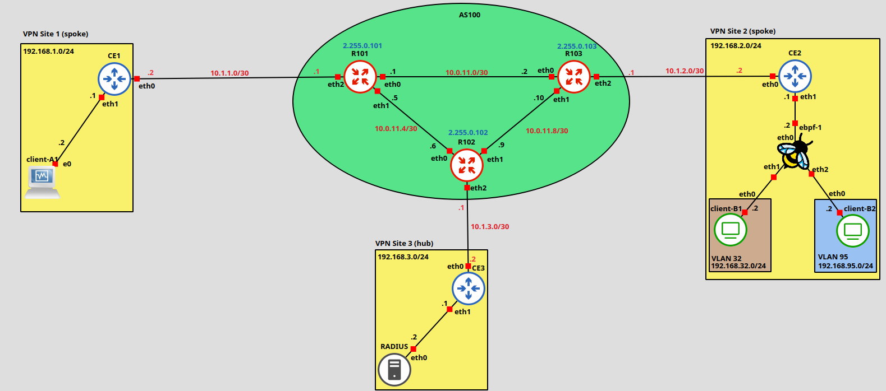

# Network and System Defense Project

## Network Topology

<p align="center">
  
</p>

---

## Network Deployment

For each node, run the local `deploy.sh` script to apply network settings (interfaces, routing, and services).
 

### AS100 Border Router Configuration

Given the three provider routers in AS100 (R101, R102, and R103), which operate as FRR routers configured via the **vtysh** configuration terminal, let us begin by detailing the setup for **R101**. While the specific steps below focus on R101, the same considerations and configuration logic apply analogously to the other border routers, R102 and R103.

#### 1. R101 Configuration Steps
The most critical configuration steps for R101 are presented below. Since the network topology and routing policies are consistent across the autonomous system, these procedures serve as the template for R102 and R103 as well.

###### `init.sh`

init.sh just brings interfaces up and assigns the /30 links plus the loopback address.

```
#!/bin/sh
set -eu

ip link set eth0 up
ip link set eth1 up
ip link set eth2 up
ip link set lo up

# Link R101 <-> R103 (10.0.11.0/30)
ip addr add 10.0.11.1/30 dev eth0

# Link R101 <-> R102 (10.0.11.4/30)
ip addr add 10.0.11.5/30 dev eth1

# Link R101 <-> CE1 (10.0.1.0/30)
ip addr add 10.1.1.1/30 dev eth2

ip addr add 2.255.0.101/32 dev lo

```

###### `frr.conf`

1. The configuration sets the router hostname to R101 and enables traditional FRR mode. It creates a stable loopback interface (lo) to serve as the permanent Router-ID.

```
!
interface lo
 ip address 2.255.0.101/32
!
```
2. The eth0 interface connects R101 to R103 through the 10.0.11.0/30 point-to-point subnet.
```
interface eth0
 ip address 10.0.11.1/30
!
```
3. The eth1 interface connects R101 to R102 through the 10.0.11.4/30 point-to-point subnet.
```
interface eth1
 ip address 10.0.11.5/30
!
```
4. The eth2 interface connects R101 to CE1 through the 10.1.1.0/30 point-to-point subnet. 
```
interface eth2
 ip address 10.1.1.1/30
!
```


5. Enables OSPF using the loopback IP as the Router-ID. It advertises all connected interfaces into Area 0, ensuring internal reachability between all routers and the customer edge within the autonomous system.
```
router ospf
 ospf router-id 2.255.0.101
 network 2.255.0.101/32 area 0
 network 10.0.11.1/30 area 0
 network 10.0.11.5/30 area 0
 network 10.1.1.1/30 area 0
!
```

6. 6. Configures iBGP:

```
router bgp 100
 bgp router-id 2.255.0.101
 neighbor 2.255.0.102 remote-as 100
 neighbor 2.255.0.102 update-source 2.255.0.101
 neighbor 2.255.0.103 remote-as 100
 neighbor 2.255.0.103 update-source 2.255.0.101
!
 address-family ipv4 unicast
  neighbor 2.255.0.102 next-hop-self
  neighbor 2.255.0.103 next-hop-self
 exit-address-family
!
```


